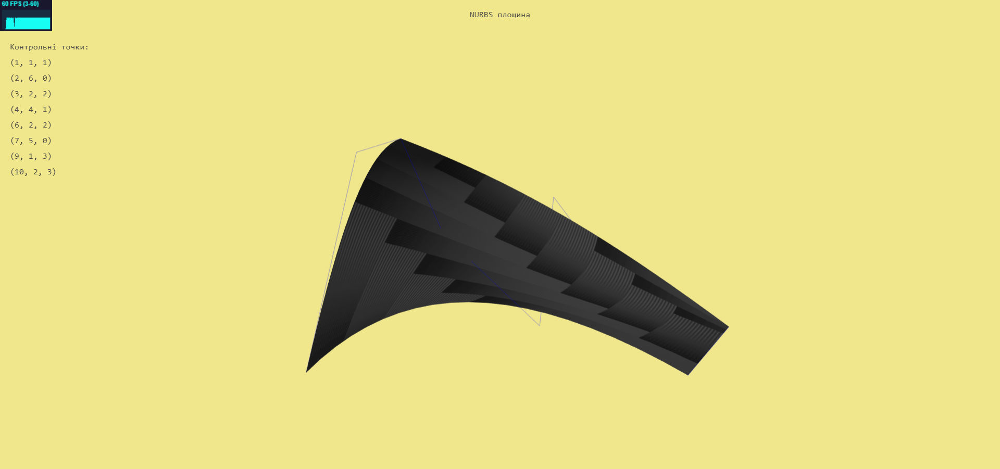
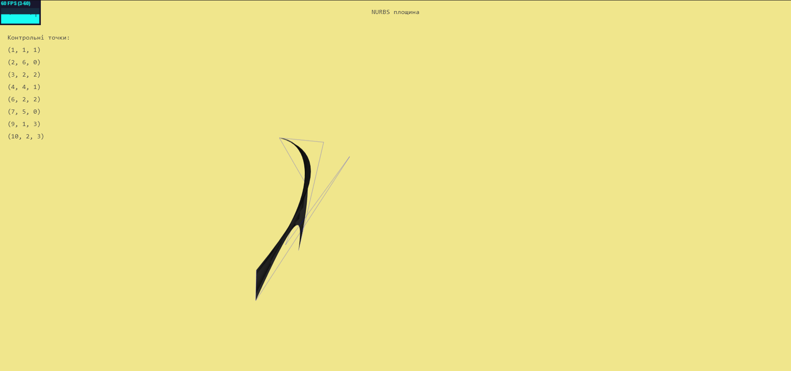

# Поверхня NURBS
Неоднорідний раціональний B-сплайн, NURBS (англ. Non-uniform rational 
B-spline) - математична форма, що застосовується в комп'ютерній графіці для 
генерування та подання кривих та поверхонь. Як видно з назви, є 
окремим випадком B-сплайнів, причому, дуже поширеним через свою 
стандартизованість та відносну простоту.

NURBS з 1983 р є стандартом IGES. IGES - це стандарт обміну проектної 
інформацією між системами автоматизованого проектування, а також між 
ними і системами автоматизованого виробництва. Раціональні B-сплайни 
реалізовані апаратно в деяких графічних робочих станціях

Поверхня Неоднорідний раціональний B-сплайну ступеня (p, q) визначається за формулою:

де 
і  - 
базисні функції B-сплайну

 - контрольні точки 

 - ваги контрольних точок

## Застосування в комп'ютерній графіці
Завдяки загальності та гнучкості NURBS-поверхні користуються популярністю. 
Так як В-сплайни являються особливим випадком NURBS-поверхонь (при hj, k = 1), 
можна використовувати єдиний алгоритм для створення обширного сімейства поверхонь.
Поверхні NURBS мають більшість всластивостей, притаманних B-сплайновим поверхням
та NURBS-кривим. NURBS-поверхні дозволяють точно описувати квадратичні поверхні, 
такі як циліндр, конус, сфера, параболоїд та гіперболоїд. Для цього дизайнером 
замість інструментарію, що складається з великої кількості різних алгоритмів 
для створення поверхонь, потрібен всього один метод.
## Приклад роботи програми
### Контрольні точки:
1. (1, 5, 1)
1. (2, 3, 0)
1. (3, 2, 2)
1. (4, 4, 1)
1. (5, 1, 2)
1. (6, 2, 0)
1. (7, 3, 3)
1. (10, 2, 3)
### Вигляд NURBS-поверхні, яка була побудована розробленою програмою:
* ракурс №1

* ракурс №2

* ракурс №3

